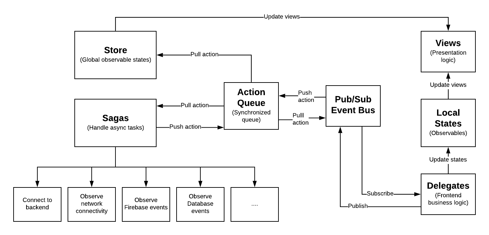

# The frontend architecture

The architecture we use is basically a modified version of Redux. We add two more components (**EventBus** and **Delegates**) to make it become an **event-driven architecture**.

This archiecture:
- reduces the usage of global state.
- makes the app more performant.
- makes it easy to reuse code.

## How it reduces the usage of global state. 
In our modified version, we are not required to use global **Store** for event-driven data because **Delegates** can also subscribe to any events to perform local state changes. Currently, we use local state to store **screen-related** data and global state to store **session-related** data.

## How it makes the app faster.
In tradition Redux, updating state in global **Store** will cause the whole app to be re-rendered unless you have some optimizations in hand. In our version, we use mostly local state thus only the views that use them will be re-rendered.

## How it makes it easy to reuse code.
We can easily extend, compose or decorate **Delegates**. For example, you can extend or use **EditSetDelegate** to handle **EDIT_SET** events on any screens.
